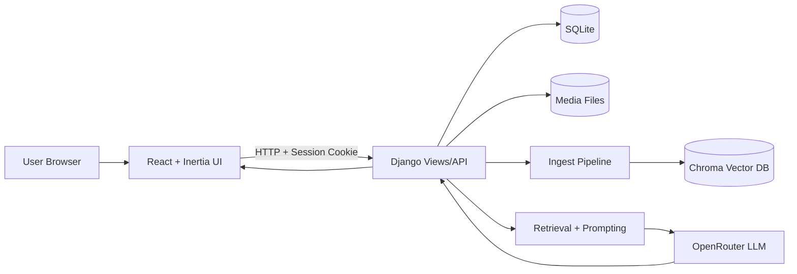

# Dokumentasi Proyek Academic RAG

## 1. Ringkasan

`academic_rag_project` adalah aplikasi **Academic Assistant** berbasis:

- **Backend**: Django (session auth, API, admin operasional, logging audit, monitoring).
- **Frontend**: React + Inertia + Vite (chat UI + planner mode + knowledge sidebar).
- **AI Engine**: RAG pipeline (ingest dokumen, embedding, vector retrieval, LLM generation).
- **Vector Store**: Chroma (`chroma_db/`) dengan isolasi data per user.

Tujuan sistem:

1. Menerima dokumen akademik (PDF/Excel/CSV/TXT/MD).
2. Mengubah dokumen menjadi knowledge base berbasis embedding.
3. Menjawab pertanyaan user dengan konteks dokumen (grounded response).
4. Menyediakan mode **Planner** untuk rekomendasi rencana studi interaktif.

---

## 2. Struktur Folder Utama

```txt
academic_rag_project/
  config/                 # Django project config (settings, urls, logging)
  core/                   # App utama: models, views, service, ai_engine, admin
  frontend/               # React + Inertia client
  chroma_db/              # Persisted vector database (Chroma)
  media/                  # Uploaded files user
  logs/                   # app.log + audit.log
  manage.py
  db.sqlite3
  requirement.txt
```

Fokus kode:

- Backend: `config/` dan `core/`
- Frontend: `frontend/`

---

## 3. Arsitektur Tingkat Tinggi



Alur inti:

1. User login/register (session-based auth).
2. User upload dokumen, backend ingest ke Chroma dengan metadata per user.
3. User chat, backend retrieve konteks lalu generate jawaban via LLM.
4. Semua aktivitas penting dicatat di audit/app log dan metrik RAG.

---

## 4. Backend (Django)

### 4.1 Konfigurasi (`config/`)

File penting:

- `config/settings.py`
- `config/urls.py`
- `config/logging_filters.py`

Konfigurasi inti:

- App: `rest_framework`, `inertia`, `django_vite`, `axes`, `core`.
- DB default: SQLite (`db.sqlite3`).
- Timezone: `Asia/Jakarta`.
- Static: dari `core/static`, build frontend di `core/static/dist`.
- Media upload: `media/`.
- Login rate limit via `django-axes`.
- Logging berlapis:
  - console formatted
  - `logs/app.log`
  - `logs/audit.log` (rotating harian)

### 4.2 Middleware Kustom (`core/middleware.py`)

1. `RequestContextMiddleware`
- Membuat `request_id` unik.
- Menyiapkan metadata audit (`request.audit`).
- Menulis 1 baris access log per request.

2. `UserPresenceMiddleware`
- Menjaga status online user (presence) secara throttled.
- Men-trigger sampling monitoring (snapshot) secara probabilistik.

3. `MaintenanceModeMiddleware`
- Memblokir akses saat maintenance aktif.
- Memungkinkan bypass staff/superuser jika diizinkan.
- Dapat force logout user non-staff.

---

## 5. Domain Model (`core/models.py`)

Model utama:

1. `AcademicDocument`
- Menyimpan file user.
- Flag `is_embedded` menandai ingest berhasil.

2. `ChatSession`
- Sesi chat per user, urut berdasarkan `updated_at`.

3. `ChatHistory`
- Riwayat Q/A per sesi.

4. `PlannerHistory`
- Event timeline planner (`start_auto`, `option_select`, `user_input`, `generate`, `save`).

5. `UserQuota`
- Kuota penyimpanan upload per user (default 10MB).

6. `LLMConfiguration`
- Runtime config model/API key OpenRouter dari DB (admin-editable).

7. `SystemSetting`
- Singleton setting global (maintenance, registration limit, concurrent login, admin dashboard polling).

8. `UserLoginPresence`
- Melacak sesi login aktif/inaktif.

9. `SystemHealthSnapshot`
- Snapshot infra (CPU/memory/disk/load/sessions).

10. `RagRequestMetric`
- Metrik tiap request RAG (latency retrieval, model, fallback, status).

---

## 6. Service Layer (`core/service.py`)

`service.py` memisahkan business logic dari views.

Use-case penting:

- `get_dashboard_props()`
- `get_documents_payload()`
- `upload_files_batch()`
- `chat_and_save()`
- Session CRUD: `list_sessions`, `create_session`, `rename_session`, `delete_session`
- Timeline: `get_session_timeline()`
- Dokumen: `delete_document_for_user()`, `reingest_documents_for_user()`
- Planner flow: `planner_start()`, `planner_continue()`, `planner_generate()`

---

## 7. API dan Routing

Routing didefinisikan di:

- `config/urls.py`
- `core/urls.py`

Halaman:

- `GET /` → Chat dashboard
- `GET/POST /login/`
- `GET/POST /register/`
- `GET /logout/`

API utama:

- `POST /api/upload/`
- `POST /api/chat/`
- `GET /api/documents/`
- `DELETE /api/documents/<doc_id>/`
- `POST /api/reingest/`
- `GET/POST /api/sessions/`
- `GET/PATCH/DELETE /api/sessions/<session_id>/`
- `GET /api/sessions/<session_id>/timeline/`

Catatan implementasi:

- Endpoint API dibungkus `@login_required`.
- Endpoint API saat ini juga memakai `@csrf_exempt` (perlu evaluasi hardening sesuai kebijakan security production).

---

## 8. AI Engine dan RAG

### 8.1 Vector & Embedding (`core/ai_engine/config.py`)

- Chroma persist directory: `chroma_db/`
- Collection name: `academic_rag`
- Default embedding: `intfloat/multilingual-e5-large`
- Prefix-aware embedding untuk model e5 (`query:` / `passage:`)

### 8.2 Ingest Pipeline (`core/ai_engine/ingest.py`)

Mendukung file:

- PDF
- XLSX/XLS
- CSV
- MD/TXT

Proses utama:

1. Parsing dokumen dan ekstraksi teks/tabel.
2. Untuk PDF jadwal: canonicalization header/row + deteksi semester/doc_type.
3. Optional hybrid repair row dengan LLM (berbasis env flag).
4. Chunking adaptif (text + row chunks).
5. Insert ke Chroma dengan metadata:
- `user_id`, `doc_id`, `source`, `file_type`, `doc_type`, `semester`, dll.

### 8.3 Retrieval + Generation (`core/ai_engine/retrieval/main.py`)

Fitur retrieval:

- Dense retrieval default.
- Optional hybrid retrieval BM25 + RRF.
- Optional rerank cross-encoder.
- Optional query rewrite.

Fitur generation:

- Prompt grounded (`LLM_FIRST_TEMPLATE`).
- Sitasi `[source: ...]` dipaksa untuk klaim faktual.
- Fallback jika konteks tidak cukup untuk pertanyaan dokumen-spesifik.
- Fallback model chain (backup models).
- Metrik request dicatat ke `RagRequestMetric`.

### 8.4 LLM Runtime Config (`core/ai_engine/retrieval/llm.py`)

Sumber konfigurasi:

1. Environment variables.
2. DB `LLMConfiguration` (prioritas lebih tinggi jika aktif/tersedia).

---

## 9. Planner Mode

Komponen planner:

- State machine: `core/academic/planner.py`
- Profile hints dari dokumen: `core/academic/profile_extractor.py`
- Grade calculator: `core/academic/grade_calculator.py`

Karakteristik:

- Multi-step interaktif (profil, tujuan, preferensi, review, generate).
- Dapat membaca kandidat jurusan/karir/semester dari dokumen user.
- Menyimpan milestone planner ke `PlannerHistory`.
- Mendukung opsi iterasi hasil (`padat`, `santai`, `ubah`, `simpan`).

---

## 10. Frontend (React + Inertia)

### 10.1 Bootstrap

- Entry: `frontend/src/main.tsx`
- Inertia dynamic page resolver: `import.meta.glob("./pages/**/*.tsx")`
- Axios global CSRF defaults disiapkan.

### 10.2 API Client

- `frontend/src/lib/api.ts`
- Base URL: `/api`
- Fungsi utama: chat, upload, documents, sessions, timeline.

### 10.3 Halaman Utama Chat

- `frontend/src/pages/Chat/Index.tsx`

Fitur:

- Mode toggle `chat` / `planner`
- Session management (create/select/rename/delete/paginate)
- Upload file (click + drag-drop)
- Delete dokumen dengan confirm modal
- Toast feedback
- Mobile sidebar drawer
- Load timeline gabungan chat + planner event

### 10.4 Komponen Kunci

- `ChatBubble`: markdown render + `rehype-sanitize` untuk mencegah XSS
- `ChatThread`: render thread + auto scroll
- `KnowledgeSidebar`: daftar dokumen, sesi, storage
- `ChatComposer`: input + upload + action send
- `AppHeader`: mode switch + theme + user menu

---

## 11. Admin, Monitoring, dan Operasional

File utama: `core/admin.py`

Fitur admin:

- CRUD dan observabilitas untuk model utama.
- Pengaturan kuota user.
- Konfigurasi runtime LLM.
- Pengaturan sistem (maintenance, registration limit, concurrent login).
- Real-time endpoint internal admin:
  - overview
  - rag metrics
  - infra health
  - active users

Monitoring backend:

- Snapshot sistem (`SystemHealthSnapshot`) via sampling middleware.
- Metrik RAG (`RagRequestMetric`) per request.

---

## 12. Logging

Dikonfigurasi di `config/settings.py` + `config/logging_filters.py`.

Jenis log:

- Access log request (ringkas).
- Application log (`logs/app.log`).
- Audit log (`logs/audit.log`) untuk event penting:
  - register/login/logout
  - upload/reingest/delete dokumen
  - session create/rename/delete
  - quota updates
  - maintenance forced logout

---

## 13. Konfigurasi Environment

Parameter yang digunakan kode (utama):

### Django

- `DEBUG`
- `SECRET_KEY`

### OpenRouter/LLM

- `OPENROUTER_API_KEY`
- `OPENROUTER_MODEL`
- `OPENROUTER_BACKUP_MODELS`
- `OPENROUTER_TIMEOUT`
- `OPENROUTER_MAX_RETRIES`
- `OPENROUTER_TEMPERATURE`

### RAG Retrieval

- `RAG_HYBRID_RETRIEVAL`
- `RAG_RERANK_ENABLED`
- `RAG_RERANK_MODEL`
- `RAG_RERANK_TOP_N`
- `RAG_DENSE_K`
- `RAG_BM25_K`
- `RAG_QUERY_REWRITE`

### Embedding

- `RAG_EMBEDDING_MODEL`
- `RAG_EMBEDDING_NORMALIZE`

### Ingest Tuning

- `RAG_DOC_CHUNK_PROFILE`
- `RAG_TEXT_CHUNK_SIZE`
- `RAG_TEXT_CHUNK_OVERLAP`
- `RAG_SCHEDULE_TEXT_CHUNK_SIZE`
- `RAG_SCHEDULE_TEXT_CHUNK_OVERLAP`
- `PDF_HYBRID_LLM_REPAIR`
- `INGEST_REPAIR_MODEL`
- `INGEST_REPAIR_TEMPERATURE`
- `INGEST_REPAIR_TIMEOUT`
- `INGEST_REPAIR_RETRIES`
- `INGEST_REPAIR_THRESHOLD`
- `INGEST_REPAIR_MAX_ROWS`
- `INGEST_REPAIR_BATCH_SIZE`

Contoh `.env` aman:

```env
DEBUG=True
SECRET_KEY=replace-with-strong-random-secret
OPENROUTER_API_KEY=replace-with-valid-key
OPENROUTER_MODEL=qwen/qwen3-next-80b-a3b-instruct:free
```

---

## 14. Menjalankan Proyek

### 14.1 Backend

```bash
pip install -r requirement.txt
python manage.py migrate
python manage.py runserver
```

### 14.2 Frontend

```bash
cd frontend
npm install
npm run dev
```

Vite dev server default: `http://localhost:5173`
Django default: `http://127.0.0.1:8000`

---

## 15. Testing

### 15.1 Backend

Lokasi test: `core/test/`

Contoh menjalankan:

```bash
python manage.py test
```

Cakupan test mencakup:

- Security/API behavior
- RAG retrieval flow
- Planner flow
- Profile extractor
- Grade calculator
- User isolation

### 15.2 Frontend

Vitest:

```bash
cd frontend
npm run test
```

Playwright E2E:

```bash
cd frontend
npm run e2e
```

Skenario E2E mencakup:

- Login success/fail/rate-limit
- Chat error handling
- Upload success/fail
- XSS sanitization
- Session flow (create/rename/delete/pagination)
- Planner mobile flow

---

## 16. Catatan Produksi dan Hardening

1. Ganti `SECRET_KEY` dan matikan `DEBUG` di production.
2. Atur `ALLOWED_HOSTS` sesuai domain deploy.
3. Kelola API key via environment atau `LLMConfiguration` admin secara aman.
4. Evaluasi penggunaan `@csrf_exempt` pada endpoint API state-changing.
5. Pastikan rotasi/retensi log sesuai kebijakan operasional.
6. Gunakan database/queue/cache production-grade jika trafik meningkat.
7. Kunci akses admin dengan kebijakan password + network restriction.

---

## 17. Ringkasan Status Implementasi

Kekuatan utama:

- Arsitektur backend relatif modular (`views` + `service` + `ai_engine`).
- Pipeline RAG sudah lengkap (ingest, hybrid retrieval, rerank, fallback model).
- Frontend UX modern dengan mode chat/planner yang terintegrasi.
- Monitoring dan admin ops cukup matang untuk fase MVP/early production.
- Test suite backend + frontend sudah cukup luas.

Area peningkatan prioritas:

- Refactor file frontend besar (`pages/Chat/Index.tsx`) menjadi modul lebih kecil.
- Hardening CSRF strategy untuk endpoint API.
- Standarisasi dokumentasi env + deployment pipeline production.

---

## 18. Referensi File Kunci

- Config Django: `config/settings.py`, `config/urls.py`
- App routes/views: `core/urls.py`, `core/views.py`
- Business logic: `core/service.py`
- Data models: `core/models.py`
- Ingest: `core/ai_engine/ingest.py`
- Retrieval: `core/ai_engine/retrieval/main.py`
- LLM runtime config: `core/ai_engine/retrieval/llm.py`
- Planner engine: `core/academic/planner.py`
- Profile extraction: `core/academic/profile_extractor.py`
- Frontend entry/API: `frontend/src/main.tsx`, `frontend/src/lib/api.ts`
- Frontend page utama: `frontend/src/pages/Chat/Index.tsx`
- Admin ops: `core/admin.py`

